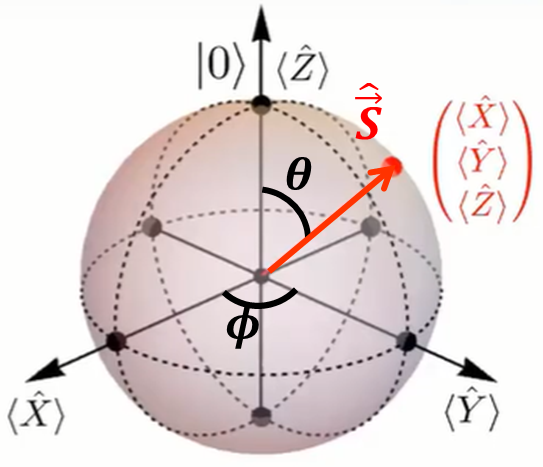

# Larmor Precession on a quantum computer
I simulated the Larmor precession quantum phenomenon using a quantum computer Qasm simulator, and show it is reliable by comparing it with a classical simulation.

