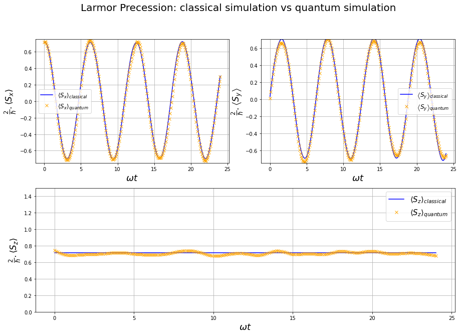

# Larmor Precession on a quantum computer
I simulated the Larmor precession quantum phenomenon using a quantum computer Qasm simulator, and show it is reliable by comparing it with a classical simulation. [See it here](https://github.com/walid-mk/Larmor.Precession.on.quantum.computer/blob/master/Larmor.Precession/larmor.precession.on.qubit.ipynb).

